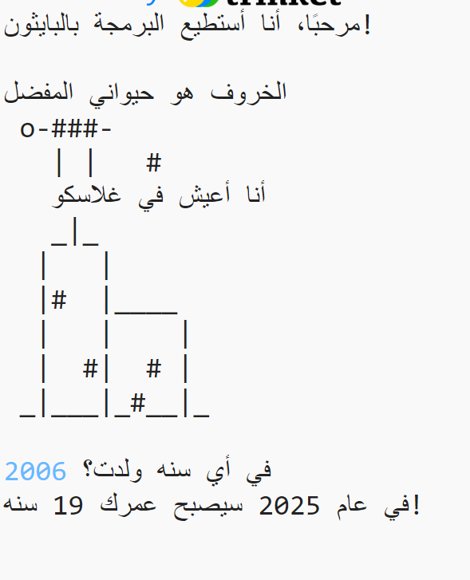

## مقدمة

ستتعلم في هذا المشروع كيفية كتابة برنامج Python لتخبر الناس كل شيء عنك.

### ما الذي يمكنك القيام به

  <iframe src="https://trinket.io/embed/python/a1f663ae0d?outputOnly=true&start=result" width="600" height="500" frameborder="0" marginwidth="0" marginheight="0" allowfullscreen>
  </iframe>
  

### ما الذي يمكنك تعلمه

يتناول هذا المشروع عناصر من الصفوف التالية من [المناهج الرقمية الخاصة بـ Raspberry Pi](http://rpf.io/curriculum){:target="_blank"}:

+ [استخدام تراكيب البرمجة الأساسية لإنشاء برامج بسيطة](https://www.raspberrypi.org/curriculum/programming/creator){:target="_blank"}

### معلومات إضافية للمعلمين

إذا كنت بحاجة إلى طباعة هذا المشروع، فيُرجى استخدام [نسخة سهلة الطباعة](https://projects.raspberrypi.org/en/projects/about-me/print){:target="_blank"}.

استخدم الرابط الموجود بتذييل الصفحة للوصول إلى مستودع GitHub الخاص بهذا المشروع، والذي يضم كل الموارد (بما في ذلك مثال لنموذج مكتمل) في مجلد 'en/resources'.
