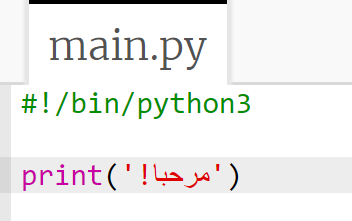
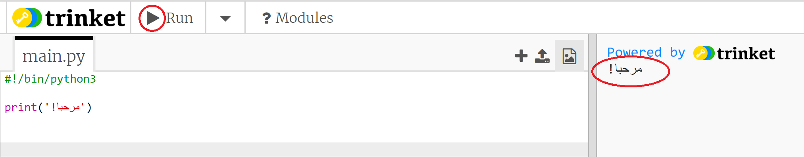
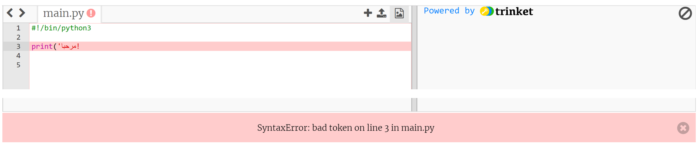
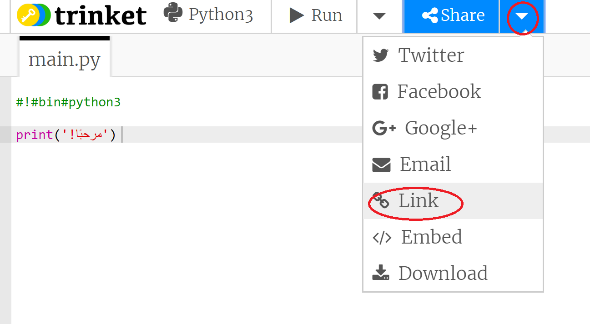

## إلقاء التحية

لنبدأ من خلال كتابة بعض النصوص.

+ افتح trinket يحتوي على قالب Python فارغ: <a href="http://jumpto.cc/python-new" target="_blank">jumpto.cc/python-new</a>.

+ اكتب ما يلي في النافذة التي يتم عرضها:

    

    يخبر السطر `#!/bin/python3` فقط Trinket أننا نستخدم Python 3 (أحدث إصدار).

+ انقر فوق **Run**، ومن المفترض أن تلاحظ أن الأمر `print()` يطبع كل شيء بين علاماتي الاقتباس `''`.

    

إذا قمت بخطأ ما، فستتلقى رسالة خطأ تخبرك بالخطأ الذي حدث بدلاً من ذلك!

+ جربها! احذف نهاية الاقتباس `'` أو قوس الإغلاق `)` (أو كليهما) وراقب ما يحدث.

    

+ أضف علامة الاقتباس أو القوس، ثم انقر فوق **Run** للتأكد من تشغيل مشروعك من جديد.

__لا تحتاج إلى حساب Trinket لحفظ مشاريعك!__

إذا لم يكن لديك حساب Trinket، فانقر فوق سهم لأسفل ثم انقر فوق **Link**. سيعطيك هذا رابطًا يمكنك حفظه والعودة إليه لاحقًا. ستحتاج إلى القيام بذلك في كل مرة تقوم فيها بإجراء تغييرات، حيث سيتغير الرابط!

إذا كان لديك حساب Trinket، فيمكنك النقر فوق **Remix** لحفظ نسختك من trinket.

