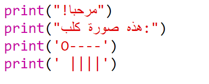
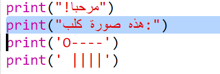
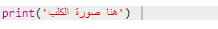
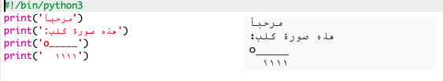
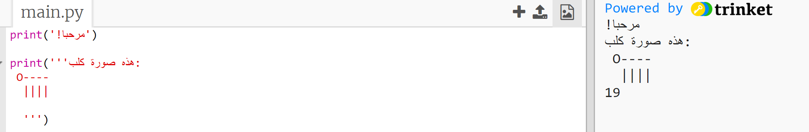

## رسم ASCII

Let’s print something much more fun than text: ASCII art! ASCII art (pronounced '*ask-e*') is creating **pictures out of text**.

+ دعونا نضيف بعض الرسوم إلى البرنامج - مثل صورة كلب!
    
    

يتم تصنيع أرجل الكلب باستخدام حرف الأنبوب ` | ` والتي يمكنك كتابتها بالضغط على <kbd> شيفت + \ </kbd> على معظم لوحات مفاتيح المملكة المتحدة / الولايات المتحدة الإنجليزية.

+ إذا نقرت على ‘run’، فسترى أن هناك خطأ في التعليمات البرمجية الجديدة.
    
    
    
    هذا لأن النص يحتوي على علامة اقتباس، يعتقد Python أنها تعني نهاية النص!
    
    

+ To fix this, just put a backslash `` before the apostrophe in the word `here's`. This tells Python that the apostrophe is part of the text.
    
    

+ يمكنك استخدام 3 علامات اقتباس ''' بدلًا من استخدام علامة اقتباس واحدة، إذا كنت تفضل ذلك، لطباعة أسطر متعددة من النص بعبارة print واحدة:
    
    