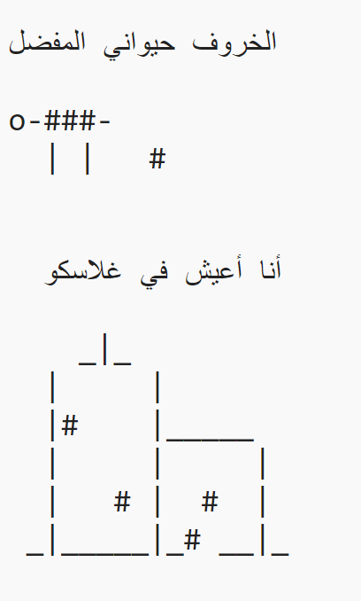

\--- challenge \---

## التحدي: عن نفسك

اكتب برنامج Python لإخبار الآخرين عن نفسك، باستخدام النص ورسم ASCII. يمكنك إنشاء صور عن هواياتك أو أصدقائك أو أي شيء تحبه!

**تذكر أن التعليمات البرمجية التي تكتبها في Trinket عامة. لا تشارك أي معلومات شخصية مثل اسمك الكامل أو عنوانك!**

فيما يلي مثال على ذلك:

\--- /challenge \---