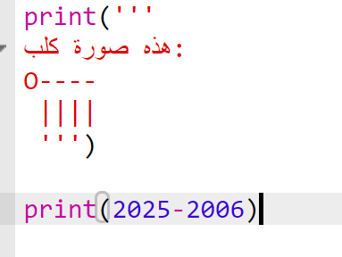
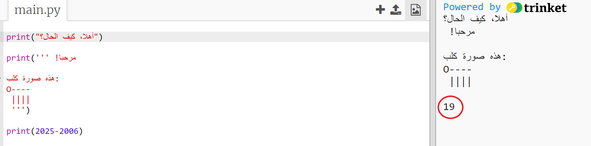
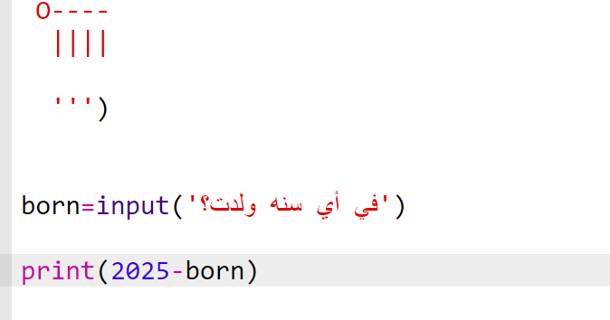
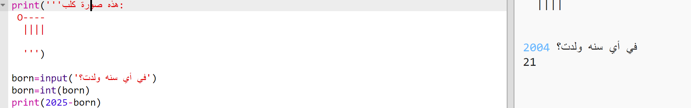
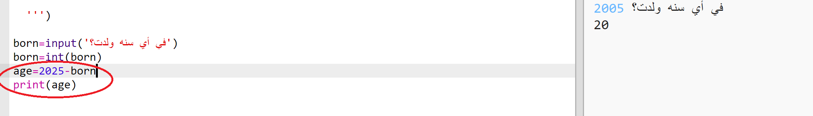
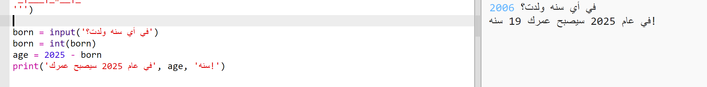

## العام 2025

يمكنك أيضًا القيام بالعمليات الحسابية وطباعة الأرقام. دعنا نكتشف كم سيكون عمرك بحلول عام 2025!

+ لحساب كم سيكون عمرك في عام 2025، تحتاج إلى طرح العام الذي ولدت فيه من 2025.

    أضف هذه التعليمات البرمجية إلى برنامجك:

    

    لاحظ أنك لا تحتاج إلى وضع علاماتي اقتباس حول الأرقام. (ستحتاج إلى تغيير الرقم `2006` إذا كنت قد ولدت في عام أخر).

+ انقر فوق **Run** وسيطبع برنامجك طباعة عمرك في عام 2025.

    

+ يمكنك تحسين البرنامج باستخدام `input()` لسؤال المستخدم عن عمره وتخزينه في __متغيّر__ يسمى `born`.

    

+ قم بتشغيل برنامجك ثم أدخل العام الذي ولدت فيه. هل تلقيت رسالة خطأ أخرى؟

    حسنًا، ذلك لأن أي شيء كتب في برنامجك هو __نص__، ويحتاج إلى تحويله إلى __رقم__.

    يمكنك استخدام `int()` لتحويل النص إلى __عدد صحيح__. يعني العدد الصحيح رقمًا صحيحًا.

    

+ يمكنك أيضًا إنشاء متغير آخر لتخزين عمليتك الحسابية، وطباعة ذلك بدلًا منها.

    

+ وأخيرًا، يمكنك إضفاء سهولة على فهم برنامجك عن طريق إضافة رسالة مفيدة.

    

