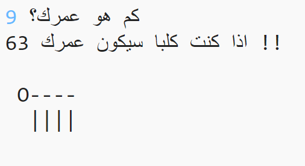

\--- challenge \---

## التحدي: عمرك بسنوات الكلب

اكتب برنامجًا يسأل المستخدم عن عمره، ثم أخبره عن عمره بسنوات الكلب! يمكنك حساب عمر شخص بسنوات الكلب عن طريق ضرب عمره في 7.

في البرمجة، يكون رمز الضرب هو `*` وعادة ما يكون <kbd>shift+8</kbd> على لوحة المفاتيح.

\--- /challenge \---