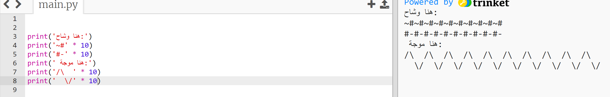

--- challenge ---

## التحدي: حساب النص

هل تعلم أنه يمكنك أيضًا حساب النص؟!

ماذا سيطبع البرنامج التالي على الشاشة؟ دعنا نرى ما إذا كان يمكنك التخمين بشكل صحيح قبل تشغيل البرنامج.

هل يمكنك تكوين أي كلمات من عندك؟ يمكنك حتى صياغة أنماطك الخاصة!

--- /challenge ---

***

## ترجمة المجتمع المساهم

تمت ترجمة هذا المشروع بواسطة **نوره سالم الدوسري** ومراجعته بواسطة **صفاء الحربي** 

يساعدنا متطوعونا الرائعون للترجمة في منح الأطفال حول العالم فرصة تعلم البرمجية. يمكنك مساعدتنا في الوصول إلى المزيد من الأطفال عن طريق ترجمة مشاريعنا - اقرأ المزيد على [rpf.io/translate](https://rpf.io/translate).