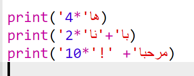

--- challenge ---

## التحدي: حساب النص

هل تعلم أنه يمكنك أيضًا حساب النص؟!

ماذا سيطبع البرنامج التالي على الشاشة؟ دعنا نرى ما إذا كان يمكنك التخمين بشكل صحيح قبل تشغيل البرنامج.

هل يمكنك تكوين أي كلمات من عندك؟ يمكنك حتى صياغة أنماطك الخاصة!

--- /challenge ---

***
تمت ترجمة هذا المشروع بواسطة متطوعين:

نوره سالم الدوسري

صفاء الحربي

نادية علي قاسم

بفضل المتطوعين ، يمكننا إعطاء الناس في جميع أنحاء العالم فرصة للتعلم بلغتهم الخاصة. يمكنك مساعدتنا في الوصول إلى المزيد من الأشخاص من خلال التطوع للترجمة - مزيد من المعلومات على [rpf.io/translate](https://rpf.io/translate).