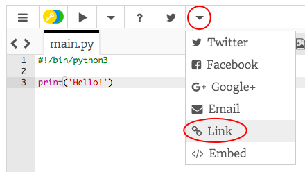

## إلقاء التحية

لنبدأ من خلال كتابة بعض النصوص.

+ Open the blank Python template trinket: <a href="http://jumpto.cc/python-new" target="_blank">jumpto.cc/python-new</a>.

+ اكتب ما يلي في النافذة التي يتم عرضها:
    
    
    
    يخبر السطر 0/>#!/bin/python3> فقط Trinket أننا نستخدم Python 3 (أحدث إصدار).
</li>
<li>
ى ‘run’، ويجب أن ترى أن الأمر print() يطبع كل شيء بين علاماتي الاقتباس ''.

</li>
</ul>

إذا قمت بخطأ ما، فستتلقى رسالة خطأ بدلًا من ذلك - تخبرك بالخطأ الذي حدث!

<ul>
<li>
جربها! احذف نهاية الاقتباس ' أو قوس الإغلاق ) (أو كليهما) وراقب ما يحدث.

</li>
<li>
استبدل علامة الاقتباس أو القوس ثم انقر فوق ‘run’ للتأكد من تشغيل مشروعك مرة أخرى.
</li>
</ul>

<strong>لا تحتاج إلى حساب Trinket لحفظ مشاريعك!</strong>

إذا لم يكن لديك حساب Trinket، فانقر فوق سهم لأسفل ثم انقر فوق ‘Link’. سيعطيك هذا رابطًا يمكنك حفظه والعودة إليه لاحقًا. ستحتاج إلى القيام بذلك في كل مرة تقوم فيها بإجراء تغييرات، حيث سيتغير الرابط!

إذا كان لديك حساب Trinket، فيمكنك النقر فوق ‘remix’ لحفظ نسختك من Trinket.

