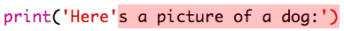

## رسم ASCII

هيا بنا نطبع شيئًا أكثر متعة من النصوص¦ رسم ASCII! رسم ASCII (تنطق ‘أسكي’) هو رسم يقوم بإنشاء صور من نصوص.

+ دعونا نضيف بعض الرسوم إلى البرنامج - مثل صورة كلب!
    
    

يتم تصنيع أرجل الكلب باستخدام حرف الأنبوب ` | ` والتي يمكنك كتابتها بالضغط على <kbd> شيفت + \ </kbd> على معظم لوحات مفاتيح المملكة المتحدة / الولايات المتحدة الإنجليزية.

+ إذا نقرت على ‘run’، فسترى أن هناك خطأ في التعليمات البرمجية الجديدة.
    
    
    
    هذا لأن النص يحتوي على علامة اقتباس، يعتقد Python أنها تعني نهاية النص!
    
    

+ لإصلاح هذا الأمر، ضع فقط شرطة مائلة للخلف \ قبل علامة الاقتباس في كلمة here's. فهذا يخبر Python أن علامة الاقتباس هي جزء من النص.
    
    

+ يمكنك استخدام 3 علامات اقتباس ''' بدلًا من استخدام علامة اقتباس واحدة، إذا كنت تفضل ذلك، لطباعة أسطر متعددة من النص بعبارة print واحدة:
    
    