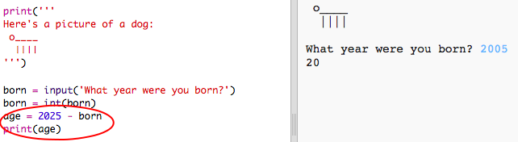

## عام 2025

يمكنك أيضًا القيام بالعمليات الحسابية وطباعة الأرقام. دعنا نكتشف كم سيكون عمرك بحلول عام 2025!

+ لحساب كم سيكون عمرك في عام 2025، تحتاج إلى طرح العام الذي ولدت فيه من 2025.
    
    أضف هذه التعليمات البرمجية إلى برنامجك:
    
    
    
    لاحظ أنك لا تحتاج إلى وضع علاماتي اقتباس حول الأرقام. (ستحتاج إلى تغيير الرقم `2006` إذا كنت قد ولدت في عام أخر).

+ انقر فوق **Run** وسيطبع برنامجك عمرك في عام 2025.
    
    

+ يمكنك تحسين البرنامج باستخدام `input()` لسؤال المستخدم عن عمره وتخزينه في متغيّر يسمى born.
    
    

+ قم بتشغيل البرنامج الخاص بك ثم أدخل العام الذي ولدت فيه. هل تلقيت رسالة خطأ أخرى؟
    
    حسنًا، ذلك لأن أي شيء كتب في برنامجك هو نص، ويحتاج إلى تحويله إلى رقم.
    
    يمكنك استخدام `int()` لتحويل النص إلى عدد صحيح (“العدد الصحيح” يعني “رقم صحيح”).
    
    

+ يمكنك أيضًا إنشاء متغير آخر لتخزين العملية الحسابية الخاصة بك، وطباعة ذلك بدلًا منها.
    
    

+ وأخيرًا، يمكنك إضفاء سهولة على فهم برنامجك عن طريق إضافة رسالة مفيدة.
    
    