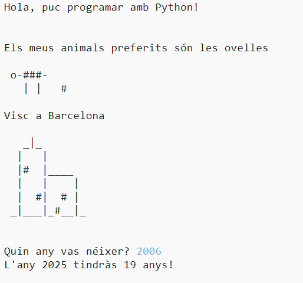

## Introducció

En aquest projecte aprendràs a escriure un programa de Python parlant sobre tu.

### Què faràs

  <iframe src="https://trinket.io/embed/python/a1f663ae0d?outputOnly=true&start=result" width="600" height="500" frameborder="0" marginwidth="0" marginheight="0" allowfullscreen>
  </iframe>
  

### Què aprendràs

Aquest projecte tracta els elements de les següents fils de [Currículum de fabricació Digital de Raspberry Pi](http://rpf.io/curriculum){:target="_blank"}:

+ [Utilitza estructures de programació senzilles per crear programes simples](https://www.raspberrypi.org/curriculum/programming/creator){:target="_blank"}

### Informació addicional per educadors

Si necessites imprimir aquest projecte, si us plau, utilitza la [Versió per imprimir](https://projects.raspberrypi.org/en/projects/about-me/print){:target="_blank"}.

Utilitza l'enllaç del peu de pàgina per accedir al repositori de GitHub per a aquest programa, el qual conté tots els recursos (incloent-hi un exemple d'un projecte complet) a la carpeta Recursos.