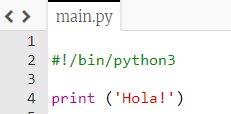
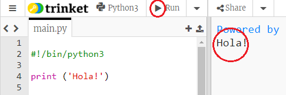
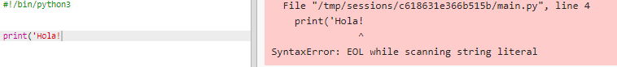
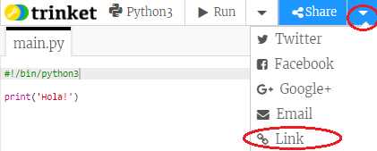

## Saludar

Pots començar escribint alguna cosa

+ Obre la plantilla en blanc de Python: <a href="http://jumpto.cc/python-new" target="_blank">jumpto.cc/python-new</a>.

+ Escriu el següent a la finestra que t'apareix:
    
    
    
    La línia `#!/bin/python3` li diu a Trinket que estem utilitzant Python 3 (la versió més actual).

+ Clica **Run** i hauries de veure que l'ordre `print()` imprimeix tot allò que es troba entre les cometes `''`.
    
    

Si comets un error, rebràs un missatge d'error que t'indicarà què ha anat malament!

+ Prova-ho! Elimina la cometa del final `'` o el parèntesi de tancament `)` (o tots dos) i observa què passa.
    
    

+ Torna a afegir la coma o el parèntesi, i clica **Run** per assegurar-te que el teu projecte torna a funcionar.

**No necessites un compte a Trinket perguardar els teus projectes!**

Si no tens un compte a Trinket, clica la fletxa cap avall i després clica **Link**. Així obtindràs un enllàç que pots guardar i utilitzar per accedir-hi en un altre moment. Caldrà repetir aquest procés cada vegada que facis canvis, ja que l'enllaç es modificarà!

Si ja tens un compte a Trinket, pots clicar **Remix** per guardar la teva còpia del trinket.

