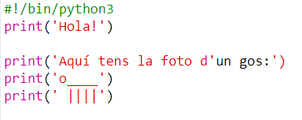
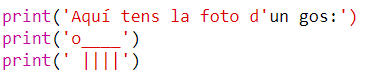
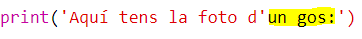
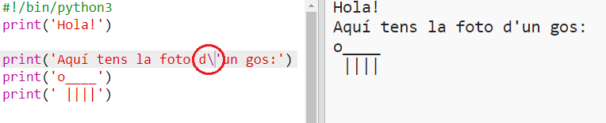
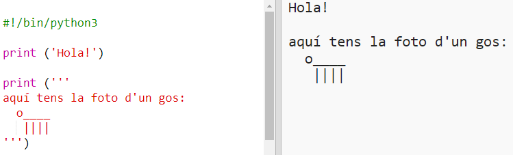

## Art ASCII

Podem imprimir coses molt més divertides que text: art ASCII! L'art ASCII (pronunciat '*ask-i*') consisteix a crear ** imatges a partir de text **.

+ Ara afegirem una mica d'art al teu programa: la foto d'un gos!
    
    

Les potes del gos s'han fet utilitzant el caràcter de tub `|` el qual pots reproduir prement les tecles <kbd>alt + 1</kbd>.

+ Si cliques **Run**, veuràs que hi ha un error en el codi nou.
    
    
    
    Això és perquè el teu text conté un apòstrof `'`, i Python pensa que es el final del text!
    
    

+ Per solucionar això, només has d'afegir una barra obliqua inversa `` abans de l'apòstrof a la paraula `d'un`. Això li diu a Python que l'apòstrof forma part del text.
    
    

+ Si ho prefereixes, pots utilitzar tres apòstrofs `'''` en lloc d'un, el qual et permetrà imprimir múltiples línies de text amb l'ordre `print`:
    
    