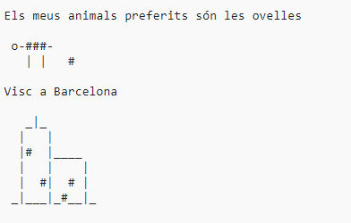

\--- challenge \---

## Repte: Sobre mi

Escriu un programa amb Python per parlar sobre tu utilitzant text is art ASCII. Pots crear imatges de les teves aficions, amics, o qualsevol cosa que t'agradi!

**Recorda que el codi que escrius a Trinket és públic. No comparteixis cap informació personal com ara el teu nom complet o addreça!**

Aquí tens un exemple:

\--- /challenge \---