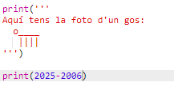
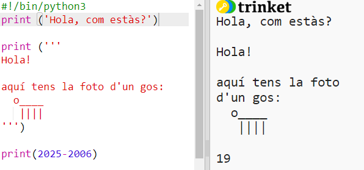
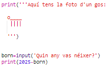
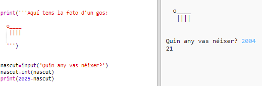
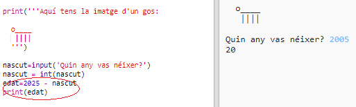
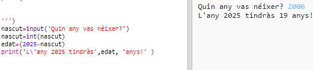

## L'any 2025

També pots fer càlculs i imprimir números. Anem a descobrir quants anys tindràs l'any 2025!

+ Per calcular els anys que tindràs l'any 2025, necessites restar l'any que vas néixer de 2025.
    
    Afegeix aquest codi al teu programa:
    
    
    
    Fixa't que no cal que posis els números entre cometes. (Necessitaràs canviar el número `2006` si vas néixer en un any diferent.)

+ Clica **Run** i el teu programa imprimirà la teva edat l'any 2025.
    
    

+ Pots millorar el teu programa utilitzant `input()` per preguntar-li a l'usuari la seva edat i desar-la en una **variable** anomenada `born`.
    
    

+ Executa el teu programa i a continuació introdueix l'any en què vas néixer. Has obtingut un altre missatger d'error?
    
    Això ha passat perquè qualsevol cosa que escriguis al teu programa és **text** i s'ha de convertir a **number**.
    
    Pots fer servir `int()` per convertir el text a un **integer**. Un "integer" es un número enter.
    
    

+ També pots crear una altra variable per desar-hi els teus càlculs i imprimir-los.
    
    

+ Finalment, pots fer un missatge d'ajuda per fer que el teu programa sigui més fàcil de comprendre.
    
    