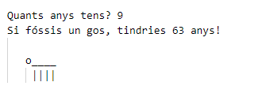

\--- challenge \---

## Repte: La teva edat en anys de gos

Escriu un programa per preguntar a l'usuari la seva edat, i després digue'ls-hi la seva edat en any de gos! Pots calcular l'edat d'una persona en anys de gos multiplicant la seva edat per 7.

En programació, el símbol per **multiplicació** és el caràcter `*`, que el pots fer prément la tecla <kbd>Shift + "+"</kbd>.

\--- /challenge \---