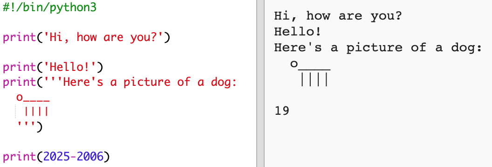

## The year 2025

Další věc, kterou můžeš udělat, je provádění výpočtů a zobrazování čísel. Zkusíme zjistit, kolik ti bude v roce 2025!

+ To calculate how old you'll be in the year 2025, you need to subtract the year you were born from 2025.
    
    Add this code to your program:
    
    
    
    Všimni si, že kolem čísel nemusíš psát uvozovky. (Číslo `2006` změň na číslo roku, kdy jsi se narodil)

+ Click **Run**, and your program should print your age in the year 2025.
    
    

+ You could improve your program by using `input()` to ask the user their age and store it in a **variable** called `born`.
    
    

+ Spusť program a vlož rok, kdy jsi se narodil. Vrátila se ti další chyba?
    
    That's because anything typed into your program is **text**, and it needs to be converted to a **number**.
    
    `Funkce int()` slouží k převodu textu na **celé číslo**. Integer je celé číslo.
    
    

+ You can also create another variable to store your calculation, and print that instead.
    
    

+ Finally, you can make your program easier to understand by adding a helpful message.
    
    