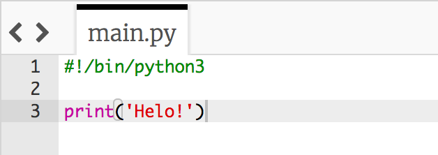
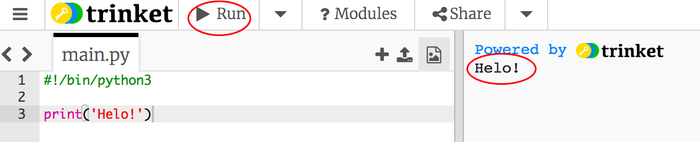
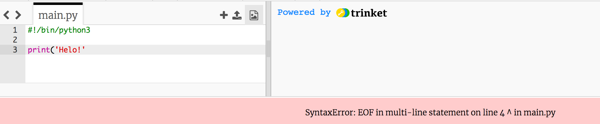
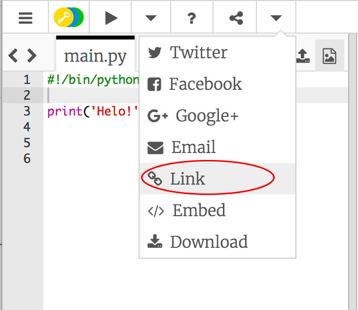

## Dweud helo

Fe wnawn ni gychwyn drwy ysgrifennu ychydig o destun. 

+ Agora'r templed Python gwag yn trinket: <a href="http://jumpto.cc/python-new" target="_blank">jumpto.cc/python-new</a>.

+ Teipia'r canlynol yn y ffenest sy'n ymddangos:

    

    Mae'r linell `#!/bin/python3` yn dweud wrth Trinket ein bod ni'n defnyddio Python 3 (sef y fersiwn ddiweddaraf). 

+ Clicia **Run**, ac fe ddyle ti weld bod y gorchymyn `print()` yn argraffu popeth rhwng y dyfynodau `''`.

    

Os wyt ti wedi gwneud camgymeriad, fe gei di neges yn dweud beth sydd wedi mynd o'i le!

+ Rho gynnig arni! Fe alli di ddileu diwedd y dyfynodau `'` neu un o'r cromfachau `)` a gweld beth sy'n digwydd.

    

+ Ychwanega'r dyfynodau neu'r cromfachau yn ôl mewn, a chlicia **Run** i sicrhau fod y prosiect yn gweithio eto.

__Does dim angen cyfrif Trinket i arbed dy brosiectau!__

Os nad oes gennyt ti gyfrif Trinket, clicia'r saeth am lawr ac yna clicia **Link**.  Bydd hwn yn rhoi dolen i ti i allu arbed ac yna dychwelyd ato rywbryd arall.  Bydd angen gwneud hyn bob tro rwyt ti'n gwneud newidiadau, gan y bydd y ddolen yn newid!

Os oes gennyt ti gyfrif Trinket, clicia **Remix** i arbed dy gopi dy hunan.

