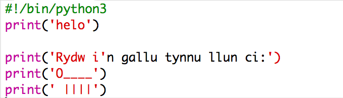
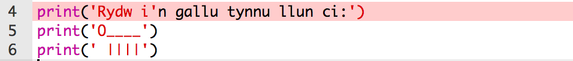
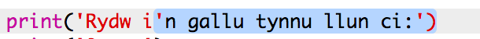
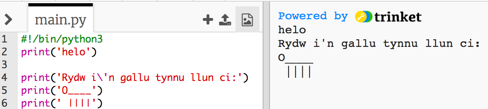
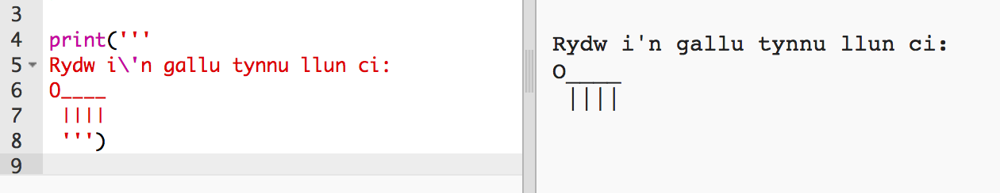

## Celf ASCII

Fe wnawn ni argraffu rhywbeth llawer mwy o hwyl na thestun: celf ASCII! Mae celf ASCII yn creu __lluniau o destun__.

+ Fe wnawn ni ychwanegu celf i'n rhaglen - llun o gi!

    

The dog's legs are made using the pipe character `|` which you can type by pressing `Shift + \` on most UK/US English keyboards. 

+ If you click **Run**, you'll see that there's a bug in your new code.

    

    That's because your text contains an apostrophe `'`, which Python thinks is the end of the text!

    

+ To fix this, just put a backslash `\` before the apostrophe in the word `here's`. This tells Python that the apostrophe is part of the text.

    

+ Mae modd defnyddio tri collnod `'''` yn lle un, sydd yn gadael i ti argraffu sawl llinell o destun gyda un datganiad `print`:

    
