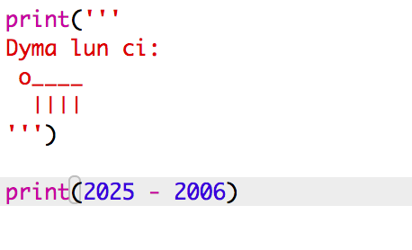
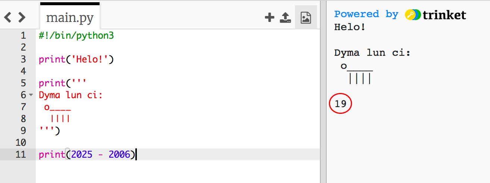
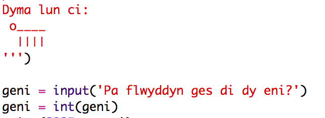
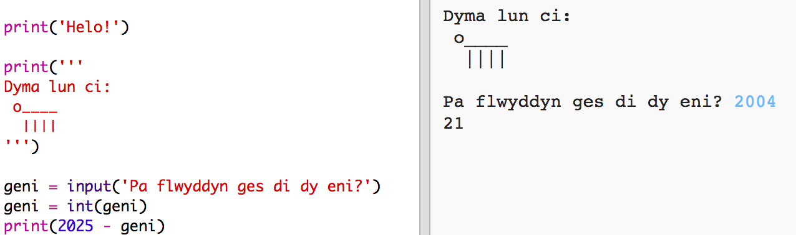
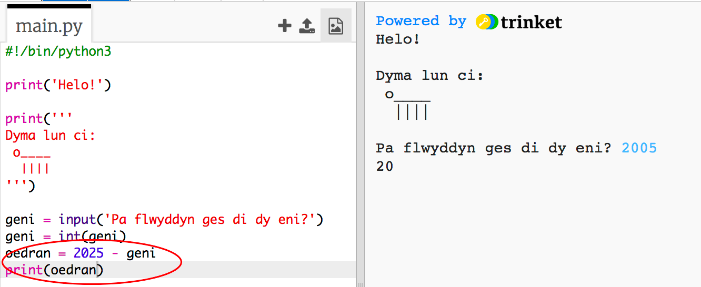
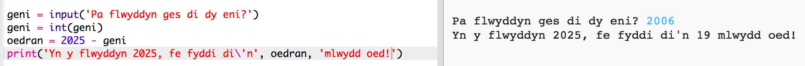

## Y flwyddyn 2025

Mae modd i ti hefyd wneud symiau ac argraffu rhifau. Fe wnawn ni ddarganfod beth fydd dy oedran di yn y flwyddyn 2025! 

+ I gyfrifo beth fydd dy oedran di yn y flwyddyn 2025, bydd angen tynnu'r flwyddyn cefaist dy eni o 2025.

    Ychwanega'r côd yma i dy raglen: 

    

    Sylwa nad oes angen rhoi dyfynodau o amgylch rhifau. (Bydd angen i ti newid y rhif `2006` os cefaist dy eni mewn blwyddyn wahanol.)

+ Clicia **Run** ac fe ddylai dy raglen brintio dy oedran yn y flwyddyn 2025.

    

+ Fe alli di wella dy raglen trey ddefnyddio `input()` i ofyn i'r defnyddiwr am eu hoedran a'i storio fel __newidyn__ o'r enw `geni`.

    

+ Rheda dy raglen a mewnbyna'r flwyddyn cefaist dy eni.  Wnes di dderbyn neges bod yna gamgymeriad?

    Mae hynny achos bod unrhywbeth sy'n cael ei deipio yn dy raglen yn __destun__ ac mae angen ei newid i __rif__.

    Mae modd defnyddio `int()` (sydd yn fyr am integer yn Saesneg) i newid testun i fod yn __gyfanrif__.  Mae integer neu cyfanrif yn golygu bod y rhif yn un cyfan.

    

+ Mae hefyd modd i ti greu newidyn arall i arbed dy symiau, a phrintio hwnnw yn lle.

    

+ Yn olaf, mae modd i ti wneud dy raglen yn haws i'w ddeall trwy ychwanegu neges ddefnyddiol.

    

