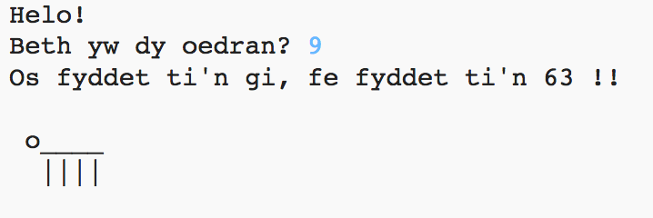

--- challenge ---
## Her: dy oedran mewn blynyddoedd ci
Ysgrifena raglen sydd yn ofyn i'r defnyddiwr am eu hoedran, ac yna rhoi gwybod iddynt beth yw eu hoedran mewn blynyddoedd ci! Mae modd cyfrifo oedran person mewn blynyddoedd ci trwy luosi'r oedran gyda 7.

Mewn rhaglenni, y symbol ar gyfer __lluosi__ yw `*`, mae modd dod o hyd i hwn fel arfer trwy wasgu `Shift + 8` ar yr allweddell.

--- /challenge ---
