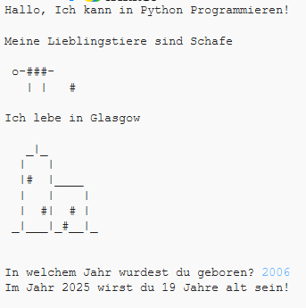

## Einführung

In diesem Projekt lernst du, wie man ein Python Programm schreibt und wie du anderen von dir erzählen kannst.

### Was du erschaffen wirst

  <iframe src="https://trinket.io/embed/python/a1f663ae0d?outputOnly=true&start=result" width="600" height="500" frameborder="0" marginwidth="0" marginheight="0" allowfullscreen>
  </iframe>
  

### Was du lernen wirst

Dieses Projekt deckt Elemente aus den folgenden Bereichen des [Raspberry Pi Lehrplans zur digitalen Produktion]{http://rpf.io/curriculum}:

+ [Einfach Programmierungskonstrukte benutzen, um einfache Programme zu erstellen.](https://www.raspberrypi.org/curriculum/programming/creator){:target="_blank"}
