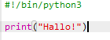
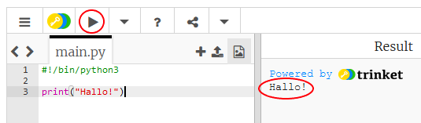
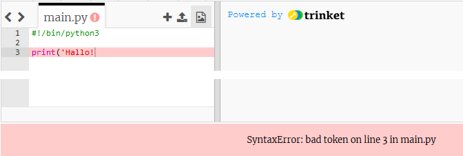
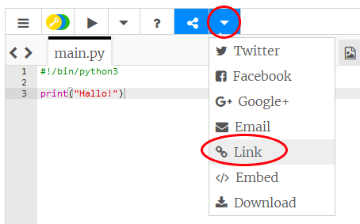

## Hallo sagen

Wir beginnen damit, einfach einen Text zu schreiben.

+ Das leere Python Vorlage- Trinket öffnen: <a href="http://jumpto.cc/python-new" target="_blank">jumpto.cc/python-new</a>.

+ Folgendes in das sich öffnende Fenster eintippen:

    

    Die Zeile `#!/bin/python3` teilt nur dem Trinket mit, dass wir Python 3 (die aktuellste Version) benutzen.

+ Auf **Run** (Programm laufen lassen) klicken und dann kann man sehen, dass der `print()` (drucken) Befehl alles druckt, was in den Anführungszeichen steht `''`.

    

Wenn du einen Fehler machst, bekommst du eine Fehlermeldung, die dir mitteilt, was schief gelaufen ist! 

+ Probier es mal! Lösche mal die End-Anführungszeichen `'` oder die schließende Klammer  `)` (oder beides) und schau, was passiert.

    

+ Die Anführungszeichen oder die Klammer ersetzen und auf 'run' (Programm laufen lassen) klicken, um zu gewährleisten, dass dein Projekt wieder funktioniert.

__Du benötigst kein Trinket Konto, um deine Projekte zu speichern!__

Falls du kein Trinket Konto hast, klicke auf den nach unten zeigenden Pfeil und klicke dann auf **Link**. So erhältst du einen Link, den du speichern und später benutzen kannst. Du musst das jedes Mal, wenn du eine Änderung vornimmst, wiederholen, da sich der Link ändern wird!

Wenn du ein Trinket Konto hast, kannst du auf **Remix** (neu mischen) klicken, um deine eigene Kopie des Trinkets zu speichern.

