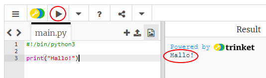

## Aufgabe: An was denkst du?

Let's start by writing some text.

+ Open the blank Python template trinket: <a href="http://jumpto.cc/python-new" target="_blank">jumpto.cc/python-new</a>.

+ Type the following into the window that appears:
    
    
    
    The line `#!/bin/python3` just tells Trinket that we're using Python 3 (the latest version).

+ Click **Run**, and you should see that the `print()` command prints everything between the quote marks `''`.
    
    

If you've made a mistake, you'll get an error message telling you what went wrong instead!

+ Try it! Delete the end quote `'` or the closing bracket `)` (or both) and see what happens.
    
    

+ Add the quote or bracket back in, and click **Run** to make sure your project works again.

**Du benötigst kein Trinket-Konto, um deine Projekte zu speichern!**

Wenn du kein Trinket-Konto hast, klicke auf den Pfeil hinunter und dann auf **Link**. Dadurch erhältst du einen Link, den du speichern und später wiederherstellen kannst. Das musst du jedes Mal tun, wenn du Änderungen vorgenommen hast, da sich der Link ändert!

If you have a Trinket account, you can click **Remix** to save your own copy of the trinket.

