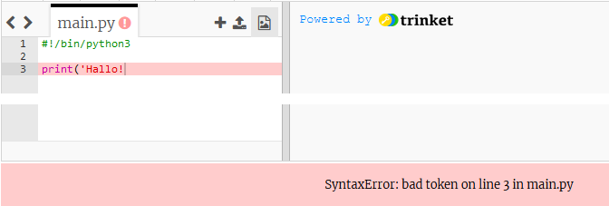

## Hallo sagen

Beginnen wir mit dem Schreiben von Text.

+ Öffne ein leeres Python-Trinket: <a href="http://jumpto.cc/python-new" target="_blank">jumpto.cc/python-new</a>.

+ Gib Folgendes in das erscheinende Fenster ein:
    
    
    
    Die Zeile `#!/bin/python3` teilt Trinket lediglich mit, dass wir Python 3 (die neueste Version) verwenden.

+ Klicke auf **Run**, und Du solltest sehen, dass der Befehl `print()` alles zwischen den Anführungszeichen `''` druckt.
    
    

Wenn Du einen Fehler gemacht hast, erhältst Du stattdessen eine Fehlermeldung, die dir sagt was schief gelaufen ist!

+ Versuche es! Lösche das letzte Anführungszeichen `'` oder die schließende Klammer `)` (oder beides) und sieh, was passiert.
    
    

+ Füge das Anführungszeichen oder die Klammer wieder hinzu und klicke auf **Run** um sicherzustellen, dass dein Projekt wieder funktioniert.

**Du benötigst kein Trinket-Konto, um deine Projekte zu speichern!**

Wenn du kein Trinket-Konto hast, klicke auf den Pfeil runter und dann auf **Link**. Dadurch erhältst du einen Link, den du speichern und später wiederherstellen kannst. Das musst du jedes Mal tun, wenn du Änderungen vorgenommen hast, da sich der Link ändert!

Wenn Du ein Trinket-Konto hast, kannst Du auf **Remix** klicken, um deine eigene Kopie des trinket zu speichern.

