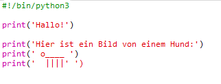
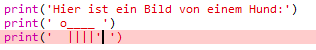
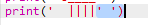
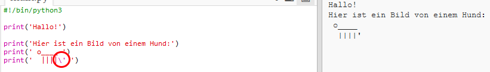
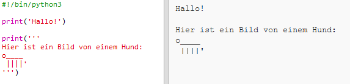

## ASCII Bild

Lass uns etwas Spannenderes drucken als nur Text… ASCII Bilder! ASCII Bild (wird'_ask-ie_' ausgesprochen) bedeutet __Bilder aus Text zu erstellen__.

+ Lass uns deinem Programm ein Bild hinzufügen: Ein Bild von einem Hund!

    

+ Wenn du auf **Run** (Programm laufen lassen) klickst, wirst du sehen, dass es einen Fehler in deinem neuen Code gibt.

    

    Das liegt daran, dass dein Text Anführungszeichen enthält, was bedeutet, dass Python denkt, es handele sich hier um das Ende eines Textes!

    

+ Um dieses Problem zu beheben, einfach einen Rückwärtsstrich `\` vor dem Anführungszeichen in dem Wort `here's` (hier ist) einfügen. Dies teilt Python mit, dass die Anführungszeichen, Teil des Textes sind.

    

+ Wenn du magst, kannst du drei (3) Anführungszeichen `'''` statt nur einem (1) benutzen, was dir ermöglicht, mehrere Zeilen von Text mit einem (1) `print` (drucken) Statement auszudrucken:

    
