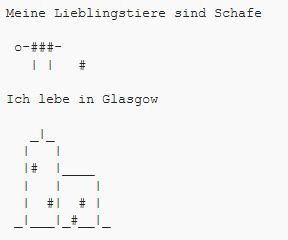

--- challenge ---
## Aufgabe: Über Dich { .challenge}
Write a Python program to tell others about yourself using text and ASCII art. You can create images of your hobbies, friends, or anything you like!

__Denke daran, dass der Code, den du in Trinket schreibst, öffentlich zugänglich ist. Teile hier keine persönlichen Informationen, wie z. B. deinen vollständigen Namen oder deine Anschrift, mit!__

Hier ist ein Beispiel:

--- /challenge ---
