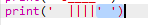

## ASCII-Kunst

Lass uns etwas drucken, das viel mehr Spaß macht als Text: ASCII-Kunst! ASCII-Kunst (ausgesprochen '*ask-i*') erzeugt **Bilder aus Text**.

+ Lass uns etwas Kunst zu deinem Programm hinzufügen - ein Bild von einem Hund!
    
    

Die Beine des Hundes werden mit dem "pipe"-Zeichen (englisch: Rohr oder Pfeife) `|` gemacht. Das Du durch Drücken von <kbd>AltGr + < </kbd> auf den meisten deutschen Tastaturen eingeben kannst.

+ Wenn Du auf **Run** klickst wirst du sehen, dass da ein Fehler in deinem neuen Code ist.
    
    
    
    Das liegt daran, dass dein Bild ein Apostroph `'` enthält, von dem Python denkt, dass es das Ende des Textes ist!
    
    

+ Um das zu beheben, setz einfach einen "Backslash" `` (AltGr+ß) vor das Apostroph im Schwanz deines Hundes `||||'`. Das sagt Python, dass der Apostroph Teil des Textes ist.
    
    

+ Wenn Du möchtest, kannst Du auch drei Apostrophe `'''` anstelle von einem verwenden, das erlaubt dir mehrere Textzeilen mit einer `print`-Anweisung zu drucken:
    
    