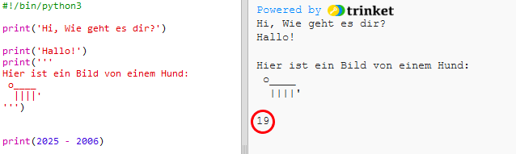

## Das Jahr 2025

Du kannst auch Rechnungen durchführen und Zahlen drucken. Lass uns herausfinden, wie alt du im Jahr 2025 sein wirst.

+ Um berechnen zu können, wie alt du im Jahr 2025 sein wirst, musst du das Jahr, in dem du geboren wurdest,  von der Jahreszahl 2025 subtrahieren.

    Gib diesen Code in dein Programm ein:

    

    Bitte beachte dabei, dass den Zahlen keine Anführungszeichen beigefügt werden müssen. (Du musst die Zahl `2006` ändern, wenn du in einem anderen Jahr geboren wurdest.)

+ Auf **Run** (Programm laufen lassen) klicken und dein Programm sollte dein Alter im Jahr 2025 drucken.

    

+ Du kannst dein Programm verbessern, indem du `input()` (Eingabe) benutzt, um den Nutzer über sein Alter zu befragen und dies in einer __Variable__ namens `born` (Geburtsdatum) speichern.

    

+ Dein Programm laufen lassen und dann das Jahr eingeben, in dem du geboren wurdest. Hast du eine weitere Fehlermeldung erhalten?

    Das liegt daran, dass alles, was in dein  Programm eingetippt wird, __Text__ ist und der muss zu einer __Ziffer__ konvertiert werden.

    Du kannst `int()`benutzen, um den Text zu einem __Integer__ zu konvertieren („Integer“ bedeutet „Ganzzahl“).

    

+ Du kannst auch eine andere Variable erstellen, um deine Rechnung zu speichern und diese dann vorzugsweise ausdrucken.

    

+ Abschließend kannst du dein Programm leichter verständlich machen, indem du eine hilfreiche Notiz hinzufügst.

    

