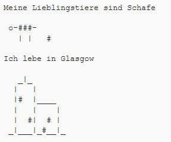

\--- challenge \---

## Herausforderung: Über dich

Schreibe ein Python-Programm, um mithilfe von Text und ASCII-Grafiken, anderen von dir zu erzählen. Du kannst Bilder Deiner Hobbys, Freunde oder allem möglichen was Du magst, erstellen!

**Denke daran, dass der Code, den Du in Trinket schreibst, öffentlich ist. Gebe keine persönlichen Daten wie deinen vollständigen Namen oder deine Adresse weiter!**

Hier ist ein Beispiel:

\--- /challenge \---