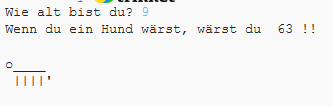

--- challenge ---
## Aufgabe: Alter in Hundejahren
Schreibe ein Programm, um den Nutzer nach seinem Alter zu fragen und ihm dann sein Alter in Hundejahren zu nennen! Du kannst das Alter einer Person in Hundejahren berechnen, indem du das Alter mit der Zahl 7 multiplizierst.

In der Programmiersprache ist das Symbol für die __Multiplikation__ `*` (Sternchen) und man findet es normalerweise wenn man __Shift+8__ (die Umschalttaste und das Sternchen) gleichzeitig auf der Tastatur drückt.

--- /challenge ---
