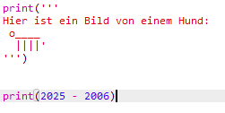
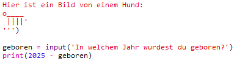
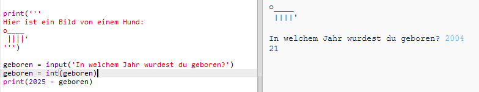

## Das Jahr 2025

Du kannst auch Berechnungen durchführen und Zahlen ausgeben. Lass uns herausfinden, wie alt Du im Jahr 2025 sein wirst!

+ Um zu berechnen, wie alt Du im Jahr 2025 sein wirst, musst Du das Jahr in dem Du geboren wurdest von 2025 subtrahieren.
    
    Füge diesen Code deinem Programm hinzu:
    
    
    
    Beachte, dass Du Zahlen nicht in Anführungszeichen setzen musst. (Du musst die Zahl `2006` ändern, wenn Du in einem anderen Jahr geboren wurdest.)

+ Klicke auf **Run** und dein Programm sollte dein Alter im Jahr 2025 ausgeben.
    
    

+ Du könntest dein Programm verbessern, indem du `input()` verwendest, um den Benutzer nach seinem Geburtsjahr zu fragen und dieses dann in einer **Variablen** namens `geboren` zu speichern.
    
    

+ Führe dein Programm aus und gib dann das Jahr ein, in dem Du geboren wurdest. Hast du eine weitere Fehlermeldung bekommen?
    
    Das liegt daran, dass alles, was in dein Programm eingegeben wird, **Text** ist und in eine **Zahl** konvertiert werden muss.
    
    Du kannst `int()` verwenden, um den Text in ein **"Integer"** umzuwandeln. Ein "Integer" ist eine ganze Zahl.
    
    

+ Du kannst auch noch eine Variable erstellen, um deine Berechnung zu speichern und dann stattdessen diese ausgeben.
    
    

+ Schließlich könntest Du dein Programm verständlicher machen, indem Du eine hilfreiche Nachricht hinzufügst.
    
    