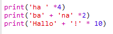
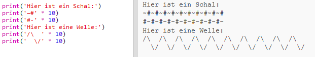

--- challenge ---
## Aufgabe: Text berechnen
Wusstest du, dass du auch Text berechnen kannst?!

Was druckt das folgende Programm auf den Bildschirm? Probiere einmal, ob du es richtig erraten kannst, ehe du das Programm laufen lässt.

Kannst du vielleicht auch eigene Worte erfinden? Du kannst auch deine eigenen Muster erstellen!

--- /challenge ---
