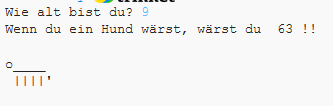

--- challenge ---

## Herausforderung: Dein Alter in Hundejahren

Schreib ein Programm, um den Benutzer nach seinem Alter zu fragen, und teile ihm dann sein Alter in Hundejahren mit! Du kannst das Alter einer Person in Hundejahren berechnen, indem Du ihr Alter mit 7 multiplizierst.

In der Programmierung ist das Symbol für die **Multiplikation** das `*` Zeichen, das Du normalerweise durch Drücken von <kbd>Shift + +</kbd> auf der Tastatur eingeben kannst.

--- /challenge ---