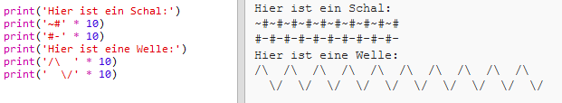

--- challenge ---

## Herausforderung: Text berechnen

Wusstest Du, dass Du auch Text berechnen kannst?!

Was wird das folgende Programm auf dem Bildschirm ausgeben? Schau mal, ob Du es richtig erraten kannst, bevor Du das Programm ausführst.

Kannst Du dir eigene Wörter einfallen lassen? Du kannst sogar Deine eigenen Muster erstellen!

--- /challenge ---

***

### Dieses Projekt wurde von freiwilligen Helfern übersetzt:

Tassilo Scherrer

Dennis Weber

Dank freiwilliger Helfer können wir Menschen auf der ganzen Welt die Möglichkeit geben, in ihrer eigenen Sprache zu lernen. Du kannst uns helfen, mehr Menschen zu erreichen, indem Du dich freiwillig zum Übersetzen meldest - weitere Informationen unter [rpf.io/translate](https://rpf.io/translate).