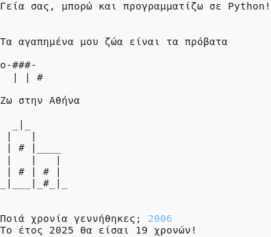

## Εισαγωγή

Σε αυτό το έργο θα μάθεις να γράφεις ένα πρόγραμμα σε Python μιλώντας για τον εαυτό σου.

### Τι θα κάνεις

  <iframe src="https://trinket.io/embed/python/e0147611e7?outputOnly=true&start=result" width="600" height="500" frameborder="0" marginwidth="0" marginheight="0" allowfullscreen>
  </iframe>
  

### Τι θα μάθεις

Αυτό το έργο καλύπτει στοιχεία από τις ακόλουθες πτυχές του [Raspberry Pi Digital Curriculum Making](http://rpf.io/curriculum){:target="_blank"}:

+ [Χρησιμοποίησε βασικές δομές προγραμματισμού για να δημιουργήσεις απλά προγράμματα](https://www.raspberrypi.org/curriculum/programming/creator){:target="_ blank"}

### Πρόσθετες πληροφορίες για εκπαιδευτικούς

Αν χρειαστεί να εκτυπώσεις αυτό το έργο, χρησιμοποίησε την [εκτυπώσιμη έκδοση](https://projects.raspberrypi.org/el-GR/projects/about-me/print)"{:target="_blank"}.

Χρησιμοποίησε το σύνδεσμο στο υποσέλιδο για να αποκτήσεις πρόσβαση στο αποθετήριο GitHub για αυτό το έργο, το οποίο περιέχει όλους τους πόρους (συμπεριλαμβανομένου ενός έργου που έχει ολοκληρωθεί στο παράδειγμα) στο φάκελο 'el-GR/resources'.