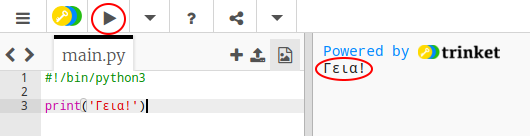
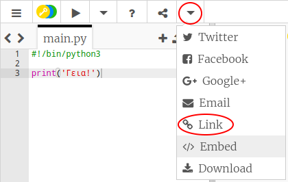

## Καλωσορίζω

Ας αρχίσουμε γράφοντας κάποιο κείμενο.

+ Ανοίξτε το κενό trinket πρότυπο Python: <a href="http://jumpto.cc/python-new" target="_blank">jumpto.cc/python-new</a>.

+ Πληκτρολογήστε τα ακόλουθα στο παράθυρο που εμφανίζεται:
    
    
    
    Η γραμμή `#! / Bin / python3` λέει απλά στο Trinket ότι χρησιμοποιούμε Python 3 (την τελευταία έκδοση).

+ Κάντε κλικ στο **Run**, και θα δείτε ότι η εντολη `print ()` εκτυπώνει τα πάντα ανάμεσα στα εισαγωγικά `«»`.
    
    

Αν έχετε κάνει κάποιο λάθος, θα λάβετε ένα μήνυμα σφάλματος που σας λέει τι συνέβη.

+ Δοκίμασέ το! Διαγράψτε την τελική παράθεση `'` ή το στήριγμα κλεισίματος `)` (ή και τα δύο) και δείτε τι συμβαίνει.
    
    

+ Προσθέστε ξανά την παράθεση ή το βραχίονα και κάντε κλικ στο **Εκτέλεση** για να βεβαιωθείτε ότι το έργο σας λειτουργεί ξανά.

**Δεν χρειάζεστε λογαριασμό Trinket για να αποθηκεύσετε τα έργα σας!**

Εάν δεν διαθέτετε λογαριασμό Trinket, κάντε κλικ στο κάτω βέλος και, στη συνέχεια, κάντε κλικ στο στοιχείο **Σύνδεση**. Αυτό θα σας δώσει έναν σύνδεσμο που μπορείτε να αποθηκεύσετε και να επιστρέψετε αργότερα. Θα πρέπει να το κάνετε αυτό κάθε φορά που κάνετε αλλαγές, καθώς ο σύνδεσμος θα αλλάξει!

Αν έχετε λογαριασμό Trinket, μπορείτε να κάνετε κλικ στο **Remix** για να αποθηκεύσετε το δικό σας αντίγραφο του μπιχλιμπίδιου.

