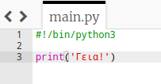

## Καλωσόρισμα

Ας αρχίσουμε γράφοντας κάποιο κείμενο.

+ Άνοιξε το κενό πρότυπο Python Trinket: <a href="http://jumpto.cc/python-new" target="_blank">jumpto.cc/python-new</a>.

+ Πληκτρολόγησε τα ακόλουθα στο παράθυρο που εμφανίζεται:
    
    
    
    Η γραμμή `#!/Bin/python3` λέει απλά στο Trinket ότι χρησιμοποιούμε την Python 3 (τελευταία έκδοση).

+ Κάνε κλικ στο **Run**, και θα δεις ότι η εντολή `print()` εμφανίζει ότι υπάρχει ανάμεσα στα εισαγωγικά `''`.
    
    

Αν έχεις κάνει κάποιο λάθος, θα λάβεις ένα μήνυμα σφάλματος που λέει τι συνέβη!

+ Δοκίμασέ το! Delete the end quote `'` or the closing bracket `)` (or both) and see what happens.
    
    

+ Add the quote or bracket back in, and click **Run** to make sure your project works again.

**You don't need a Trinket account to save your projects!**

If you don't have a Trinket account, click the down arrow and then click **Link**. This will give you a link that you can save and come back to later. You'll need to do this every time you make changes, as the link will change!

If you have a Trinket account, you can click **Remix** to save your own copy of the trinket.

