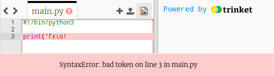

## Καλωσόρισμα

Ας αρχίσουμε γράφοντας κάποιο κείμενο.

+ Άνοιξε το κενό πρότυπο Python Trinket: <a href="http://jumpto.cc/python-new" target="_blank">jumpto.cc/python-new</a>.

+ Πληκτρολόγησε τα ακόλουθα στο παράθυρο που εμφανίζεται:
    
    
    
    Η γραμμή `#!/Bin/python3` λέει απλά στο Trinket ότι χρησιμοποιούμε την Python 3 (τελευταία έκδοση).

+ Κάνε κλικ στο **Run**, και θα δεις ότι η εντολή `print()` εμφανίζει ότι υπάρχει ανάμεσα στα εισαγωγικά `''`.
    
    

Αν έχεις κάνει κάποιο λάθος, θα λάβεις ένα μήνυμα σφάλματος που λέει τι συνέβη!

+ Δοκίμασέ το! Διέγραψε την τελική απόστροφο `'` ή τη δεξιά παρένθεση `)` (ή και τα δύο) και δες τι συμβαίνει.
    
    

+ Πρόσθεσε ξανά την απόστροφο ή την παρένθεση και κάνε κλικ στο **Run** για να βεβαιωθείς ότι το έργο σου λειτουργεί ξανά.

**Δεν χρειάζεσαι λογαριασμό Trinket για να αποθηκεύσεις τα έργα σου!**

Εάν δεν διαθέτεις λογαριασμό Trinket, κάνε κλικ στο κάτω βέλος και, στη συνέχεια, κάνε κλικ στην επιλογή **Link**. Αυτό θα σου δώσει έναν σύνδεσμο που μπορείς να αποθηκεύσεις και να επιστρέψεις αργότερα. Θα πρέπει να το κάνεις αυτό κάθε φορά που κάνεις αλλαγές, καθώς ο σύνδεσμος θα αλλάζει!

Αν έχεις λογαριασμό Trinket, μπορείς να κάνεις κλικ στο **Remix** για να αποθηκεύσεις το δικό σου αντίγραφο του Trinket.

