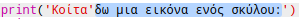
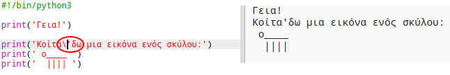
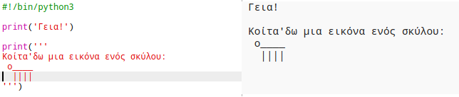

## Τέχνη ASCII

Ας εκτυπώσουμε κάτι πολύ πιο διασκεδαστικό από το κείμενο: Τέχνη ASCII! Με την τέχνη ASCII (προφέρεται '*άσκι*') δημιουργούμε **εικόνες από κείμενο**.

+ Ας προσθέσουμε μια εικόνα από κείμενο στο πρόγραμμά σου - μια εικόνα ενός σκύλου!
    
    

Τα πόδια του σκύλου φτιάχνονται χρησιμοποιώντας τον χαρακτήρα σωλήνα `|` που μπορείς να πληκτρολογήσεις πιέζοντας <kbd>Shift + \ </kbd> στα περισσότερα πληκτρολόγια Αγγλίας/ΗΠΑ.

+ Αν κάνεις κλικ στο **Run**, θα δεις ότι υπάρχει ένα σφάλμα στο νέο σου κώδικα.
    
    
    
    Αυτό συμβαίνει επειδή το κείμενό σου περιέχει μία απόστροφο `'`, την οποία η Python θεωρεί ότι είναι το τέλος του κειμένου!
    
    

+ Για να το διορθώσεις, απλώς βάλε μια ανάστροφη κάθετο `\` πριν από την απόστροφο στη λέξη `here's`. Αυτό λέει στην Python ότι η απόστροφος είναι μέρος του κειμένου.
    
    

+ Αν προτιμάς, μπορείς να χρησιμοποιήσεις τρεις αποστρόφους `'''` αντί για μία, κάτι που σου επιτρέπει να εμφανίσεις πολλές γραμμές κειμένου με μία εντολή `print`:
    
    