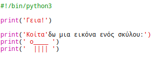
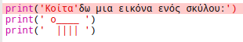

## ASCII τέχνη

Ας εκτυπώσουμε κάτι πολύ πιο διασκεδαστικό από το κείμενο: ASCII art! Η τέχνη ASCII (προφέρεται '*ask-e*') δημιουργεί **εικόνες από το κείμενο**.

+ Ας προσθέσουμε κάποια τέχνη στο πρόγραμμά σας - μια εικόνα ενός σκύλου!
    
    

Τα πόδια του σκύλου κατασκευάζονται χρησιμοποιώντας τον χαρακτήρα σωλήνα `|` που μπορείτε να πληκτρολογήσετε πιέζοντας <kbd>Shift + \ </kbd> στα περισσότερα πληκτρολόγια Αγγλίας / ΗΠΑ.

+ Αν κάνετε κλικ στο **Run**, θα δείτε ότι υπάρχει ένα σφάλμα το νέο σας κωδικό.
    
    
    
    Αυτό συμβαίνει επειδή το κείμενό σας περιέχει ένα απόστροφο `'`, το οποίο η Python θεωρεί ότι είναι το τέλος του κειμένου!
    
    

+ Για να το διορθώσετε, απλώς βάλτε μια ανάστροφη κάθετο `3_1_321 πριν από την απόστροφο στη λέξη <code>εδώ είναι`. Αυτό λέει στην Python ότι το απόστροφο είναι μέρος του κειμένου.
    
    

+ Αν προτιμάτε, μπορείτε να χρησιμοποιήσετε τρία απόσπασμα `'' '` αντί για ένα, το οποίο σας επιτρέπει να εκτυπώνετε πολλές γραμμές κειμένου με μία δήλωση `εκτύπωσης`:
    
    