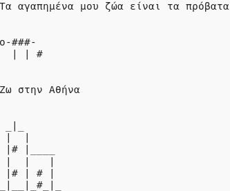

--- challenge ---

## Πρόκληση: Για τον εαυτό σου

Γράψε ένα πρόγραμμα Python για να συστηθείς στον κόσμο χρησιμοποιώντας κείμενο και ASCII τέχνη. Μπορείς να δημιουργήσεις εικόνες από τα χόμπι, τους φίλους σου ή οτιδήποτε άλλο σας αρέσει!

**Θυμήσου ότι ο κώδικας που γράφεις στο Trinket είναι δημόσιος. Μην μοιράζεσαι προσωπικά στοιχεία όπως το πλήρες όνομα ή τη διεύθυνσή σου!**

Ακολουθεί ένα παράδειγμα:

--- /challenge ---