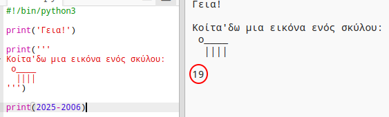
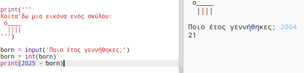

## Το έτος 2025

Μπορείς επίσης να κάνεις υπολογισμούς και να εμφανίσεις αριθμούς. Ας μάθουμε πόσο χρονών θα είσαι στο έτος 2025!

+ Για να υπολογίσεις πόσο χρονών θα είσαι το έτος 2025, θα πρέπει να αφαιρέσεις το έτος που γεννήθηκες από το 2025.
    
    Πρόσθεσε αυτόν τον κώδικα στο πρόγραμμά σου:
    
    
    
    Παρατήρησε ότι δεν χρειάζεται να βάλεις εισαγωγικά γύρω από τους αριθμούς. (Θα χρειαστεί να αλλάξεις τον αριθμό `2006` εάν γεννήθηκες σε διαφορετικό έτος.)

+ Κάνε κλικ στο **Run**, και το πρόγραμμά σου θα πρέπει να εμφανίσει την ηλικία σου το έτος 2025.
    
    

+ Θα μπορούσες να βελτιώσεις το πρόγραμμά σου με τη χρήση της εντολής `input()` για να ζητά από το χρήστη την ηλικία του και να την αποθηκεύει σε μια **μεταβλητή** που ονομάζεται `born`.
    
    

+ Εκτέλεσε το πρόγραμμά σου και μετά πληκτρολόγησε το έτος που γεννήθηκες. Έλαβες και άλλο μήνυμα λάθους;
    
    Αυτό συμβαίνει επειδή ότι πληκτρολόγησες στο πρόγραμμά σου είναι **κείμενο**και πρέπει να μετατραπεί σε **αριθμό**.
    
    Μπορείς να χρησιμοποιήσεις την εντολή `int ()` για να μετατρέψεις το κείμενο σε **integer**. Ο integer είναι ένας ακέραιος αριθμός.
    
    

+ Μπορείς επίσης να δημιουργήσεις μια άλλη μεταβλητή για να αποθηκεύσεις τον υπολογισμό σου και να την εμφανίσεις.
    
    

+ Τέλος, μπορείς να κάνεις το πρόγραμμά σου πιο κατανοητό προσθέτοντας ένα χρήσιμο μήνυμα.
    
    