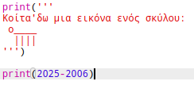
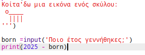
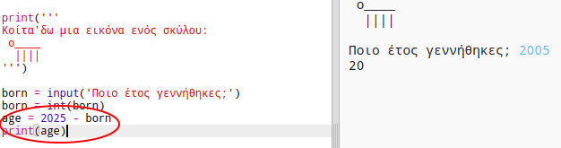
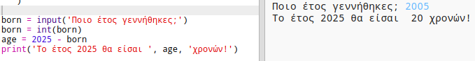

## Το έτος 2025

Μπορείτε επίσης να κάνετε υπολογισμούς και να εκτυπώσετε αριθμούς. Ας μάθουμε πόσο χρονών θα είστε στο έτος 2025!

+ Για να υπολογίσετε πόσο χρονών θα είστε το έτος 2025, θα πρέπει να αφαιρέσετε το έτος που γεννηθήκατε από το 2025.
    
    Προσθέστε αυτόν τον κώδικα στο πρόγραμμα σας:
    
    
    
    Παρατηρήστε ότι δεν χρειάζεται να βάλετε εισαγωγικά γύρω από τους αριθμούς. (Θα χρειαστεί να αλλάξετε τον αριθμό `2006` εάν γεννηθήκατε σε διαφορετικό έτος.)

+ Κάντε κλικ στο **Run**, και το πρόγραμμά σας θα πρέπει να εκτυπώσετε την ηλικία σας κατά το έτος 2025.
    
    

+ Θα μπορούσαν να βελτιώσουν το πρόγραμμά σας με τη χρήση `input()` για να ζητήσει από το χρήστη την ηλικία τους και να το αποθηκεύσετε σε μια **μεταβλητή** που ονομάζεται `born`.
    
    

+ Εκτελέστε το πρόγραμμά σας και μετά εισάγετε το έτος που γεννηθήκατε. Λάβατε άλλο μήνυμα λάθους;
    
    Αυτό συμβαίνει επειδή οτι πληκτρολογήσατε στο πρόγραμμά σας είναι **κείμενο**και πρέπει να μετατραπεί σε **αριθμό**.
    
    Μπορείτε να χρησιμοποιήσετε `int ()` για να μετατρέψετε το κείμενο σε **ακέραιο αριθμό**. Ο interger είναι ένας ακέραιος αριθμός.
    
    

+ Μπορείτε επίσης να δημιουργήσετε μια άλλη μεταβλητή για να αποθηκεύσετε τον υπολογισμό σας και να την εκτυπώσετε.
    
    

+ Τέλος, μπορείτε να καταστήσετε το πρόγραμμά σας πιο κατανοητό προσθέτοντας ένα χρήσιμο μήνυμα.
    
    