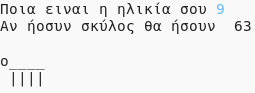

\--- challenge \---

## Πρόκληση: Η ηλικία σας στα σκυλιά χρόνια

Γράψτε ένα πρόγραμμα για να ρωτήσετε τον χρήστη την ηλικία τους, και στη συνέχεια να τους πείτε την ηλικία τους στα σκυλιά χρόνια! Μπορείτε να υπολογίσετε την ηλικία ενός ατόμου σε χρόνια σκύλων πολλαπλασιάζοντας την ηλικία του κατά 7.

Στον προγραμματισμό, το σύμβολο **πολλαπλασιασμού** είναι το `*` σύμβολο, το οποίο συνήθως μπορείτε να πληκτρολογήσετε πατώντας <kbd>Shift + 8</kbd> στο πληκτρολόγιο.

\--- /challenge \---