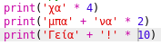

--- challenge ---

## Πρόκληση: Υπολογισμός κειμένου

Γνώριζες ότι μπορείς επίσης να υπολογίσεις κείμενο;

Τι θα εμφανίσει το επόμενο πρόγραμμα στην οθόνη; Δες εάν μπορείς να μαντέψεις σωστά πριν εκτελέσεις το πρόγραμμα.

Μπορείς να δημιουργήσεις οποιεσδήποτε δικές σου λέξεις; Θα μπορούσες ακόμη να φτιάξεις τα δικά σου σχέδια!

--- /challenge ---

***
### Κοινοτική συνεισφορά μετάφρασης

Το έργο αυτό μεταφράστηκε από **Νίκος Γρηγορόπουλος** και αναθεωρήθηκε από **Γιώργος Νικολαΐδης**. 

Οι εκπληκτικοί μας εθελοντές-μεταφραστές μας βοηθούν να δώσουμε στα παιδιά όλου του κόσμου την ευκαιρία να μάθουν να προγραμματίζουν. Μπορείτε να μας βοηθήσετε να προσεγγίσουμε περισσότερα παιδιά μεταφράζοντας τα έργα μας - διαβάστε περισσότερα στο [rpf.io/translators](https://rpf.io/translators).
