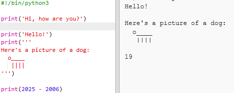

## The year 2025

You can also do calculations and print numbers. Let's find out how old you'll be in the year 2025!

+ To calculate how old you'll be in the year 2025, you need to subtract the year you were born from 2025.

    Add this code to your program:

    

    Notice that you don't need to put quotes around numbers. (You'll need to change the number `2006` if you were born in a different year.)

+ Click **Run**, and your program should print your age in the year 2025.

    

+ You could improve your program by using `input()` to ask the user their age and store it in a __variable__ called `born`.

    

+ Run your program and then enter the year you were born. Did you get another error message?

    That's because anything typed into your program is __text__, and it needs to be converted to a __number__.

    You can use `int()` to convert the text to an __integer__. An integer is a whole number.

    

+ You can also create another variable to store your calculation, and print that instead.

    

+ Finally, you can make your program easier to understand by adding a helpful message.

    

