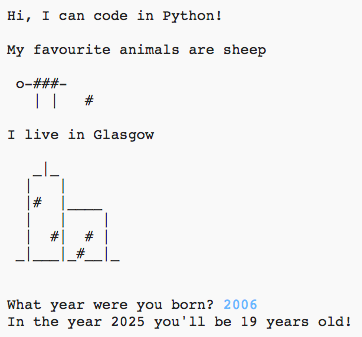

## Introducción

A través de este proyecto, aprenderás a escribir un programa Python contando cosas sobre ti.

### Lo que crearás

  <iframe src="https://trinket.io/embed/python/a1f663ae0d?outputOnly=true&start=result" width="600" height="500" frameborder="0" marginwidth="0" marginheight="0" allowfullscreen>
  </iframe>
  

### Lo que aprenderás

Este proyecto incluye elementos de los siguientes aspectos del [currículo de creación digital de Raspberry Pi](http://rpf.io/curriculum){:target="_blank"}:

+ [Usa constructos de programación básicos para crear programas simples](https://www.raspberrypi.org/curriculum/programming/creator){:target="_blank"}

### Información adicional para los educadores

Si necesitas imprimir este proyecto, use la [versión para imprimir](https://projects.raspberrypi.org/en/projects/about-me/print){:target="_blank"}.

Usa el enlace en el pie de página para acceder al repositorio de GitHub para este proyecto, que contiene todos los recursos (incluso un ejemplo de un proyecto terminado) en la carpeta 'en/resources'.