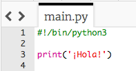
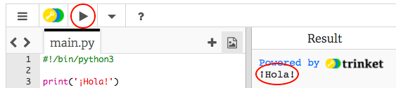
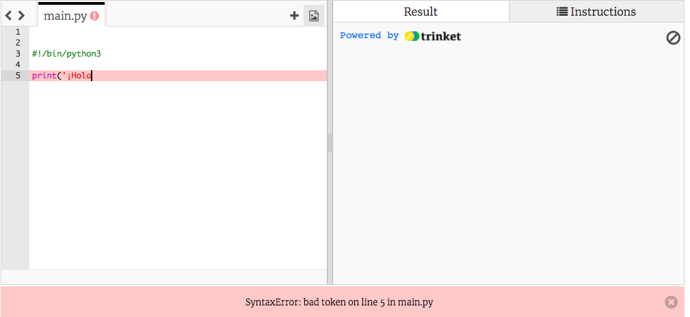
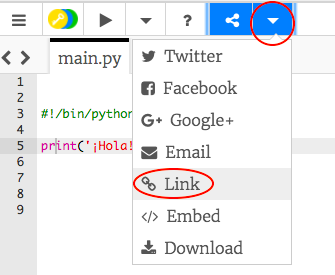

## Saludar

Comencemos escribiendo texto.

+ Abre el Trinket de la plantilla en blanco de Python: <a href="http://jumpto.cc/python-new" target="_blank">jumpto.cc/python-new</a>. 

+ Escribe lo siguiente en la ventana visualizada:

    

    La línea `#!/bin/python3` simplemente informa a Trinket de que estamos usando Python 3 (la última versión).

+ Pulsa 'run' y verás que el comando `print()` imprime todo el texto que se encuentre entre comillas `''`.

    

+ Si cometes un error, ¡recibirás un mensaje de error indicándote qué salió mal! 

    ¡Pruébalo! Borra la última comilla `'` o el último paréntesis `)` (o ambos) y comprueba qué sucede.

    

+ Vuelve a escribir la comilla o el paréntesis y haz clic en 'run' para asegurarte de que el proyecto vuelve a funcionar correctamente.

__¡No necesitas una cuenta Trinket para guardar proyectos!__ 

Si no tienes una cuenta Trinket, haz clic en la flecha abajo y, a continuación, haz clic en 'Link'. Obtendrás un enlace que podrás guardar y al que podrás regresar más tarde. Deberás hacer esto cada vez que realices cambios, puesto que el enlace será distinto.

Si tienes una cuenta Trinket, puedes hacer clic en 'remix' para guardar tu propia copia del Trinket.

